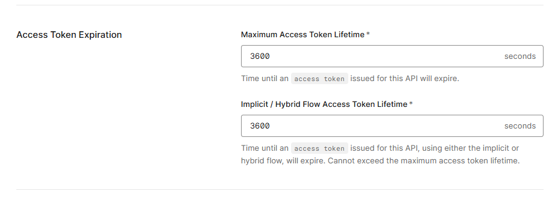
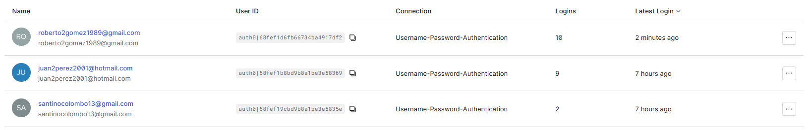
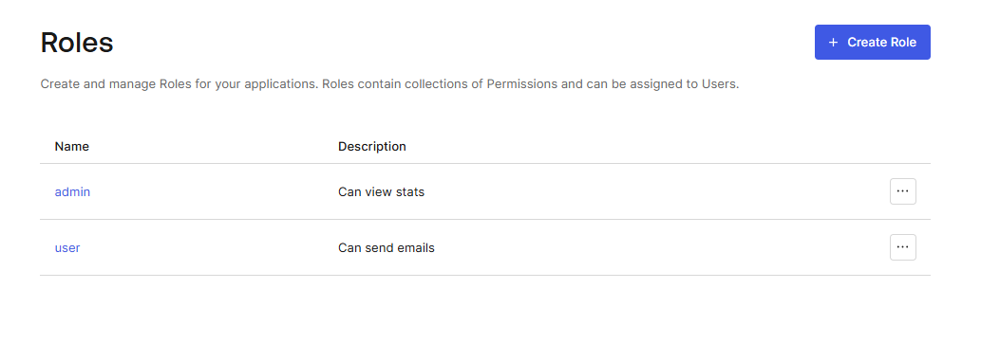
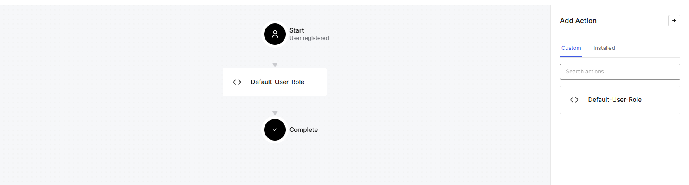
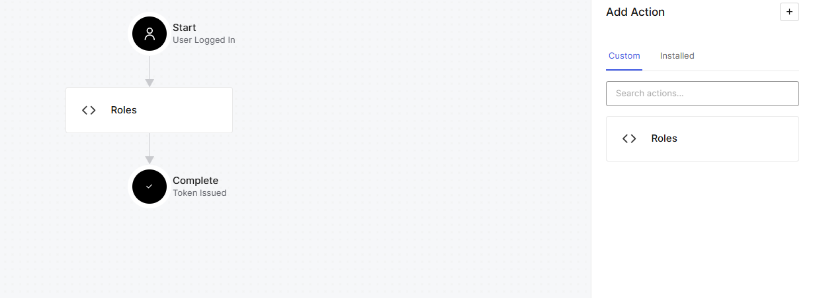

# 📧 Sirius Challenge – Email Service

> Servicio backend de envío de correos con autenticación Auth0, contenedorizado con Docker y soportado por SendGrid y SparkPost.

---

## 🧩 Descripción General

**SiriusChallenge** es una API REST construida con **Spring Boot** que permite:
- Autenticación y autorización mediante **Auth0 (JWT)**
- Envío de correos usando **SendGrid** (fallback automático) y **SparkPost** (proveedor principal que siempre falla)
- Persistencia en **PostgreSQL**
- Ejecución completa con **Docker Compose**

Este proyecto implementa principios de arquitectura limpia, seguridad basada en roles y patrones de diseño orientados a extensibilidad y resiliencia.

---

## 🔐 Autenticación con Auth0

La autenticación se gestiona con **Auth0** mediante una **Regular Web Application**, permitiendo manejar usuarios finales, roles y claims personalizados.

### 🔑 Características principales
- Validación de JWT en backend mediante `Spring Security`
- Roles: `user`, `admin`
- Claims personalizados:
    - `https://backendchallenge/roles`
    - `https://backendchallenge/email`
- Asignación automática del rol `user` tras el registro

### 🖼️ Evidencias visuales

**Expiración del token**


**Usuarios registrados**


**Roles creados**


**Asignación automática del rol "user"**


**Validación de roles Post Login**


---

## ⚙️ Ejecución con Docker Compose

El entorno se levanta completo con un solo comando:

```bash
docker-compose up
